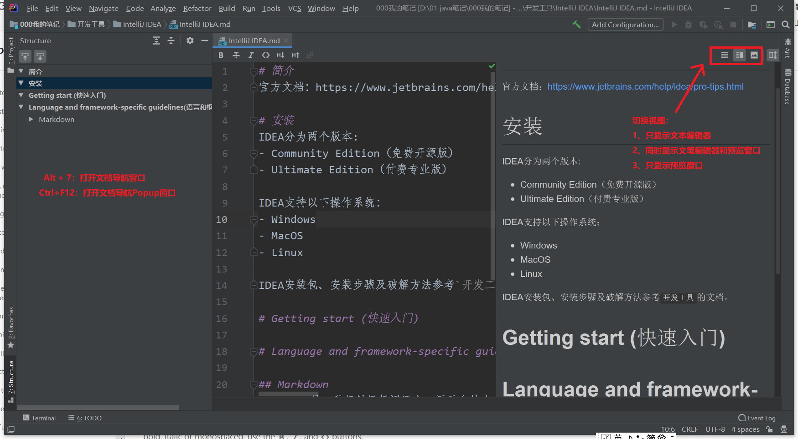

# 简介
官方文档：https://www.jetbrains.com/help/idea/pro-tips.html

# 安装
IDEA分为两个版本:
- Community Edition（免费开源版）
- Ultimate Edition（付费专业版）

IDEA支持以下操作系统：
- Windows
- MacOS
- Linux

IDEA安装包、安装步骤及破解方法参考`开发工具`的文档。

# Getting start (快速入门)

# Language and framework-specific guidelines(语言和框架专用指南)

## Markdown
Markdown是一种轻量级标记语言，用于向纯文本添加格式元素。
[Markdown](https://www.markdownguide.org/getting-started) is a lightweight markup language for adding formatting elements to plain text.

IntelliJ IDEA默认自动安装并启用Markdown插件（The Markdown Support plugin）。IDEA识别到.md文件，会自动用Markdown插件打开该文件。

### Markdown插件介绍


Markdown插件如上图所示，
- 右上角三个按钮可以切换视图模式。
- `Alt+7`可以打开文档导航窗口。`Ctrl+F12`可以打开文档导航Popup窗口。
>You can also manage whether the editor and preview pane are split vertically or horizontally. To do this, open the Settings/Preferences dialog Ctrl+Alt+S, go to the Languages & Frameworks | Markdown page and use the Editor and Preview Panel Layout option

#### Markdown基础语法
超链接：[Markdown](https://www.markdownguide.org/getting-started)

链接文件：[链接文件](test.txt)

图片：``

Blockquotey用法：
>dfsfdaf

表格:

| Syntax | Description |
| ----------- | ----------- |
| Header | Title |
| Paragraph | Text | 

有序列表：
1. 第一个文件
2. 第二个文件

无序列表：
- First item
- Second item
- Third item

待办列表：
- [x] Write the press release
- [ ] Update the website
- [ ] Contact the media 

代码：
```java
public class Test {
public static void main(String[] args){
  System.out.println(1);
}
}
```

#### 图表
IntelliJ IDEA支持显示可视化图表，通过使用[DOT](https://en.wikipedia.org/wiki)和[PlantUML](http://plantuml.com/)可视化语言。
>注意：使用前需安装PlantUML插件。安装步骤（需翻墙）：
>1、打开Markdown设置。打开设置对话框`Ctrl+Alt+S`，进到Languages & Frameworks | Markdown页面
>2、点击PlantUML framework旁边的Install按钮。

图表功能在gitHub暂时无法使用。

时序图：

```puml
Alice -> Bob: Authentication Request
Bob --> Alice: Authentication Response

Alice -> Bob: Another authentication Request
Alice <-- Bob: another authentication Response
```

```plantuml
Alice -> Bob: Authentication Request
Bob --> Alice: Authentication Response

Alice -> Bob: Another authentication Request
Alice <-- Bob: another authentication Response
```

用例图：

```plantuml
(First usecase)
(Another usecase) as (UC2)  
usecase UC3
usecase (Last\nusecase) as UC4
```

部署图：
```plantuml
!define Junction_Or circle #black
!define Junction_And circle #whitesmoke

Junction_And JunctionAnd
Junction_Or JunctionOr

archimate #Technology "VPN Server" as vpnServerA <<technology-device>>

rectangle GO #lightgreen
rectangle STOP #red
rectangle WAIT #orange
GO -up-> JunctionOr
STOP -up-> JunctionOr
STOP -down-> JunctionAnd
WAIT -down-> JunctionAnd
```


 
